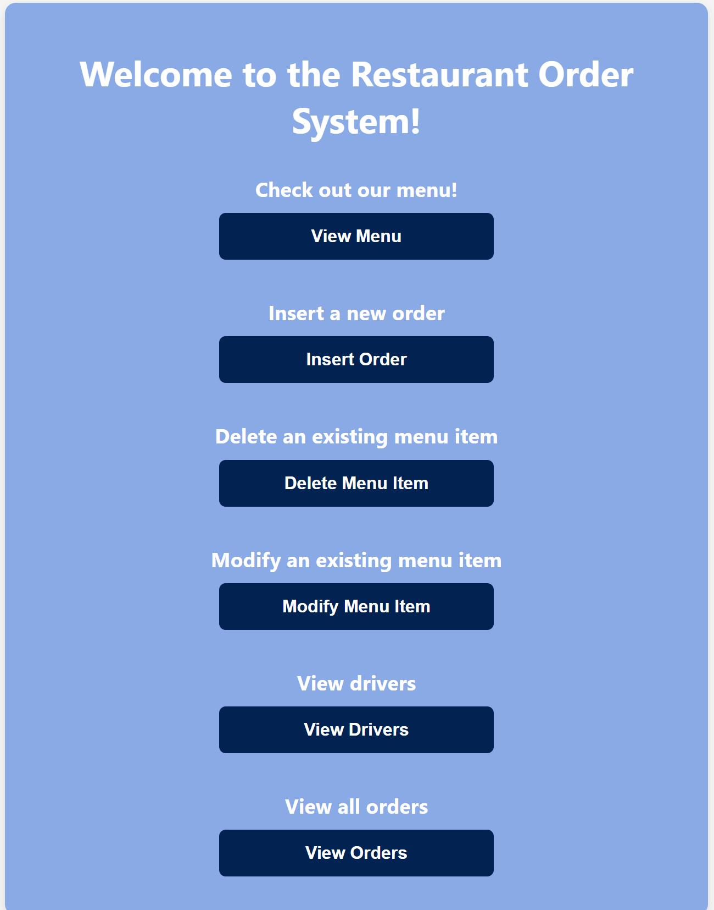

# Restaurant Order Management System (PHP/MySQL)

A dynamic web-based system for managing restaurant orders, menu items, drivers, and customers. Built entirely in PHP with MySQL integration and a custom CSS front-end.

---

## Project Images

## 🎯 Project Summary

This was a full-stack PHP application built for a class project. It handles the entire restaurant order lifecycle from placing orders and managing menu items to assigning drivers and viewing past orders. Data is stored in a MySQL database and dynamically rendered with PHP.

---

## 🛠Technologies Used

- **PHP** – Core backend logic and form handling  
- **MySQL** – Data storage and query execution  
- **HTML/CSS** – UI and layout  
- **SQL JOINs** – For multi-table views and reports  
- **Post/Redirect/Get** – Clean form workflows
- **JavaScript (Light Use)** – Client-side sorting in the menu view (viewmenu.php)

---

## Features

- Insert new customer orders with multiple menu items  
- Delete a menu item (and cascade-remove associated orders)  
- Modify menu item price and calorie info  
- View all available menu items with sorting options  
- View drivers who haven’t made any deliveries  
- View detailed past orders with itemized pricing

---

## Database Note
This project was originally deployed on a local server with a MySQL database (assign2db). The database file is no longer available, so this repo is for reference purposes only — showcasing code structure, UI design, and PHP logic.

## Challenges Faced
- Ensuring referential integrity when deleting menu items with foreign key dependencies
- Handling form validation for date/time inputs and quantity inputs
- Dynamically generating and validating multi-item form submissions (order creation)
- Using LEFT JOINs to extract “never delivered” driver data

## TODO / Improvements
- Add login/authentication for admin access
- Implement AJAX for smoother form handling
- Add delivery rating update feature
- Create API endpoints for mobile or JS frontend integration
